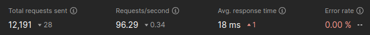

# play-rfc6750

An example project, showcasing how to extract an OAuth2 Bearer 
Token ([RFC 6750](https://datatracker.ietf.org/doc/html/rfc6750))
from an incoming request inside a Play Framework [Filter](https://www.playframework.com/documentation/3.0.x/Filters).
This includes reading it from an `application/x-www-form-urlencoded` encoded
request body, which is not easily accessible from within a Play Filter.


## Performance

The implementation uses an Essential Action and ~~Akka Streams~~ Pekko Streams
to prevent duplicate body parsing and achieve a highly performant solution.
I did a few, rather unscientific tests, and enabling the Filter
seems to hardly have any impact on performance.



This is using Postman with fixed load, 100 virtual users (VU) and running for 2 minutes. 
All requests sent are POST requests where the values in the body are randomly generated per request.

```txt
{{$randomUuid}}={{$randomWord}}
access_token={{$randomWord}}
```

| Run      | Total Requests | Requests/s | Resp. Time (Avg ms) |
|----------|----------------|------------|---------------------|
| Disabled | 12'219         | 96.63      | 17                  | 
| Enabled  | 12'191         | 96.43      | 18                  | 
